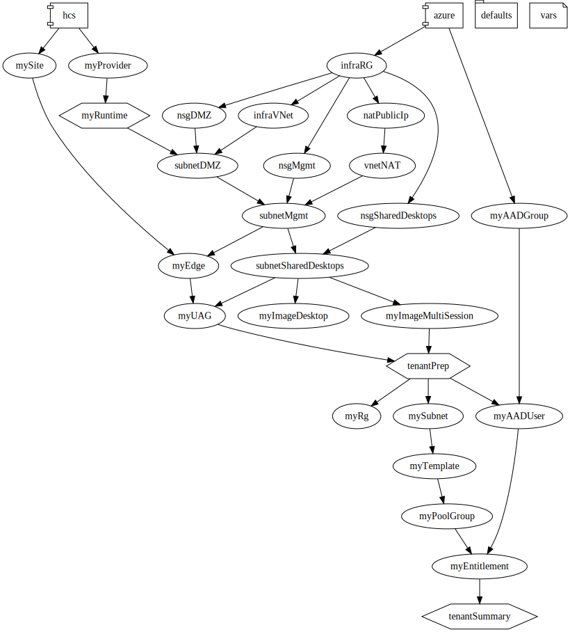

# HCS Plan

- [HCS Plan](#hcs-plan)
  - [Introduction](#introduction)
  - [Capabilities](#capabilities)
  - [Getting Started](#getting-started)
    - [Apply a Plan](#apply-a-plan)
    - [Destroy Resources of a Plan](#destroy-resources-of-a-plan)
    - [Deployment Graph](#deployment-graph)
  - [File Types](#file-types)
    - [Plan File](#plan-file)
    - [State File](#state-file)
  - [Plan File Syntax](#plan-file-syntax)
    - [Sections Explained](#sections-explained)
      - [The Variable Section](#the-variable-section)
      - [The Blueprint Section](#the-blueprint-section)
      - [Deployment ID](#deployment-id)
      - [vars](#vars)
      - [Defaults](#defaults)
      - [Resources](#resources)
      - [Runtimes](#runtimes)
      - [Providers](#providers)
    - [Resource Dependency](#resource-dependency)
      - [Example - No dependency](#example---no-dependency)
      - [Example - Implicit dependency](#example---implicit-dependency)
      - [Example - Explicit dependency](#example---explicit-dependency)
    - [Conditional Resource](#conditional-resource)
    - [Multiple Resources from Array](#multiple-resources-from-array)
    - [Map list to a new list](#map-list-to-a-new-list)
      - [Plan File Examples](#plan-file-examples)
    - [Referencing profile value](#referencing-profile-value)
  - [Cheatsheet](#cheatsheet)
  - [Principles](#principles)
    - [Provider](#provider)
  - [Idempotency](#idempotency)
  - [Extension: Support New Resources](#extension-support-new-resources)
    - [Implementing a new resource handler](#implementing-a-new-resource-handler)
    - [Implementing a new runtime](#implementing-a-new-runtime)
    - [Implementing a new provider](#implementing-a-new-provider)

## Introduction
HCS Plan is the deployment engine to manage HCS resources in a declarative way.

The engine accepts a plan file to deploy or destroy resources.

## Capabilities
* **Deployment with orchestration** - Deployment is submitted only once in the form of a single operation, and the execution follows the plan. Resource dependencies are identified internall.
* **Destroy with orchestration** - Destroy of a plan is also submitted only once in the form of a single operation. The resources will be destroyed in reverse order based on their dependency relationship.
* **Resumable** - deployment/destroy can be resumed from where it stops.
* **Parallel Execution** - Dependencies between resources are automatically analyzed. Resources will be processed in parallel wherever possible. 
* **Execution control** - Parallel execution can be disabled so all resources are deployed in sequential. Resources can also have explicit execution order defined to achieve sequential deployment when needed.
* **Convention-based Idempotency** - In the area of checking for existing resources, besides the check based on the previous state, concrete resource plugins can implement the convention-based check by name, to achieve idempotency.
* **Single resource operation** - Instead of working with the entire blueprint, a single resource can be specified to deploy/destroy.
* **Extension support** - Additional resources handler can be added to support new type of resources. Custom logic can be implemented in the form of runtime-plugins. 
  
## Getting Started
### Apply a Plan
```bash
hcs plan apply -f <plan-file>
```
There are two modes of deployment progress supported:
* The default log-based output (Default for non-TTY).
* An interactive mode with progress bars (Default for TTY).

  

### Destroy Resources of a Plan
```bash
hcs plan destroy -f <plan-file>
```

### Deployment Graph
According to a plan file, the engine identifies the declared resources, analyzes the dependencies, and executes accordingly.

```bash
hcs plan graph -f <plan-file>
```
Example of plan graph:




## File Types

### Plan File
- A plan file is the target for deployment and destroy.
- A plan file consists of two sections:
  - A variable section: all the dynamic input of the plan.
  - A blue print section: definition of the resources to deploy.
- A plan file is normally named as _\<deployment-id\>.plan.yml_.

### State File
- During deployment, a state file is generated to store the execution states. Named as _\<deployment-id\>.state.yml_.


## Plan File Syntax
### Sections Explained

#### The Variable Section
The variable section defines all the input.
| Name         | Required | Description  |
|--------------|----------|--------------|
| deploymentId | Required | A string to uniquely name a deployment. |
| vars         | Optional | All the input variables. |
  
#### The Blueprint Section
The blueprint section defines the resources.
| Name         | Required | Description  |
|--------------|----------|--------------|
| defaults     | Optional | A custom section for shared values. |
| resources    | Optional | The resources to deploy. |
| runtimes     | Optional | The custom logic. |
| providers    | Optional | Provider initialization data. |

#### Deployment ID

```yml
# ------------
# deploymentId
# ------------
# The unique deployment ID to distinguish one deployment 
# from another. Resources will be tagged based on the deploymentId 
# if possible, and smart refresh should also consider deploymentId 
# to identify related resource, upon missing previous state.
deploymentId: myCustomer1
```

#### vars
```yml
# ------------
# vars
# ------------
# The vars section is the input of the blueprint. All top-level variables are specified here.
# 
vars:
  provider: 0123
  name: abc
```

#### Defaults
```yml
# ------------------------
# Custom sections
# ------------------------

# Custom sections can be defined to manipulate the variables.
# For example, the common 'defaults' section is used to define
# shared variable calculation, to avoid duplicated calculation
# in each resource.
# Variables are quoted by "${}"
defaults:
  name: titan-lite-${deploymentId}
```

#### Resources
```yml
# ------------------------
# The resources section
# ------------------------
# The resources to be created. A map from unique resource 
# name to resource definition.

resources:
  myAADGroup:
    kind: azure/aad-group
    data:
        tenant: ${vars.tenantId}
```

#### Runtimes
```yml
# ------------------------------------------------
# [Optional] The runtimes section
# ------------------------------------------------
# The runtimes section consists of runtime objects,
# normally non-resource related calculation that's hard to achieve,
# or require additional system-read to get. E.g. given resource id,
# identify resource name by invoking a system API.
# The runtime is similar to resource item, 
runtimes:
  myCalculator:
    # impl specifies the runtime module
    impl: vhcs.plan.provider.dev.fibonacci
    # data specifies the input object to the runtime
    data:
      n: 10
```

#### Providers
```yml
# ------------------------------------------------
# [Optional] The providers section
# Provider is the first part in the resource kind attribute.
# For example, in kind="dev/dummy", the provider id is "dev",
# and the resource type is "dummy". Provider may also need
# initialization. The providers section provides the configuration
# to initalize a provider. The provider is always initiaized before
# it's used for the first time.
# This section is optional.
# ------------------------------------------------
providers:
  dev:
    data: ${vars}
```

### Resource Dependency

By default, dependency between resources are automatically calculated, as long as a resource uses the output of another resource.

#### Example - No dependency
```yaml
# Resource r1 and r2 has no dependency, so they may be deployed in parallel
resources:
  r1:
    kind: dev/dummy
  r2:
    kind: dev/dummy
```

#### Example - Implicit dependency
```yaml
# Resource r2 references output of r1. So it will be deployed after r1.
resources:
  r1:
    kind: dev/dummy
    data:
        text: hello
        delay: 1s
  r2:
    kind: dev/dummy
    data:
        text: ${r1.outputText}
```

#### Example - Explicit dependency
```yaml
# Resource r2 has no reference of r1. By specifying the "after" property,
# it's explicitly specified to be deployed after r1.
resources:
  r1:
    kind: dev/dummy
    data:
        delay: 1s
  r2:
    kind: dev/dummy
    after:
    - r1
```

### Conditional Resource
```yaml
# Resouces can be deployed only under certain condition.
vars:
  guest1: Alice
  guest2:
resources:
  r1:
    kind: dev/dummy
    conditions:
      # A logical condition named 'has_guest1' is defined.
      # Since vars.guest1 has value Alice, r1 will be deployed.
      has_guest1: ${vars.guest1}
    data:
      text: hello
  r2:
    kind: dev/dummy
    conditions:
      # This 'has_guest2' logical condition checks the value 
      # of vars.guest2. Since it's empty, resource r2 will not
      # be deployed.
      has_guest2: ${vars.guest2}
    data:
      text: hello
  r11:
    kind: dev/dummy
    conditions:
      # r11 will be deployed, after r1 is deployed.
      has_r1: ${r1.outputText}
  r21:
    kind: dev/dummy
    conditions:
      # r21 will not be deployed, because r2 is not deployed.
      has_r2: ${r2.outputText}
```

### Multiple Resources from Array

```yaml
vars:
  userEmails:
  - a@b.com
  - c@d.com
resources:
  myAADUsers:
    kind: azure/aad-user
    # The 'for' statement references an array, and add the name-value pair into each instance input data.
    for: email in vars.userEmails
    data:
      group: ${myAADGroup.id}
# In azure/aad-user resource handler, the received data object
# will have 'email' added, as declared in the 'for' statement:
#    {
#        'group': '<group-id>'
#        'email': '<one-of-the-emails>
#    }
```

### Map list to a new list
```yaml
vars:
  tenantId: <the-tenant-id>
  userEmails:
  - u1@mydomain.com
  - u2@mydomain.com
resources:
  myAADGroup:
    kind: azure/aad-group
    data:
        tenant: ${vars.tenantId}
  myAADUsers:
    kind: azure/aad-user
    # Based on the array, multiple "aad-user" objects will be created.
    # The output of 'myAADUsers' will be an array, matching input from vars.userEmails.
    for: email in vars.userEmails
    data:
      group: ${myAADGroup.id}
  myEntitlement:
    kind: hcs/entitlement
    data:
      orgId: ${vars.orgId}
      poolIds:
      - ${myPoolGroup.id}
      resourceDetails:
      - poolId: ${myPoolGroup.id}
      # Mapping array to array
      userIds: ${[for u in myAADUser: u.id]}
```

The resource myEntitlement will receive data object with field 'userIds' as an string array:
```json
{
  'userIds': [ 'user-id1', 'user-id2' ],
  ...
}
```

#### Plan File Examples
* [Example from UT file](../tests/vhcs/cli/cmds/plan/test_plan.py#L27)
* [Example from DaaS blueprint](../vhcs/support/daas/templates/v1/)

### Referencing profile value
```yaml
resources:
  myLaunchItem:
    kind: hcs/launch-item
    data:
      users: ...
      entitlementId: ...
      domainName: ...
      stackUrl: ${profile.hcs.url}
```


## Cheatsheet
| Command | Description |
| ------- | ----------- |
| hcs plan graph -f \<filename\> | View the resource dependency graph. |
| hcs plan apply -f \<filename\> --sequential | Deploy resources sequentially, for debugging |
| hcs plan apply -f \<filename\> --resource \<resource-id\> | Deploy only the specified resource. |
| hcs plan destroy -f \<filename\> | Destroy a deployment. |
| hcs plan destroy -f \<filename\> --resource \<resource-id\> | Destroy only the specified resource. |


## Principles
### Provider
- Each provider should focus on a single API
- Resources should represent a single API object
- Resource and attribute schema should closely match the underlying API

## Idempotency

The idempotency of deployment relies on two aspects:
1. The framework defines “refresh” and “decide” operation for each resource handler. After correctly implementing the verbs in each resource plugin, the framework will skip already handled resources and proceed with only items that need operation.
2. Some resources have complex state (e.g. multiple deploying states). The concrete resource handler implementation handles the idempotency (e.g. based on the state to determine what to do next and what to wait for). E.g. HCS edge, HCS UAG, HCS images.

## Extension: Support New Resources
### Implementing a new resource handler
A resource handler is the module to handle a specific resource. For example, HCS template.
Refer to existing implementations as example:
* [UT dummy resource handler](../vhcs/plan/provider/dev/dummy.py)
* [HCS resource handlers](../vhcs/plan/provider/hcs/)

### Implementing a new runtime
A runtime is a custom logic that normally does not deploy resources, but gather information from the some services via API, and does some calculation.

* [UT test runtime](../vhcs/plan/provider/dev/fibonacci.py)
* [DaaS runtime](../vhcs/support/daas/infra_green.py)
  

### Implementing a new provider
A provider represents the resource handlers from the same service. E.g. the Azure handler for operating Azure resources, the HCS handler for operating HCS resources.

Refer to existing implementations as example:
* [UT test provider](../vhcs/plan/provider/hcs/)
* [HCS provider](../vhcs/plan/provider/hcs/)
